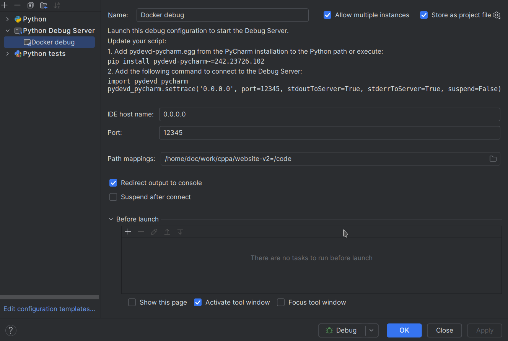

# Boost.org Website

## Overview

A Django based website that will power a new Boost website. See the [documentation](./docs/README.md) for more information about maintaining this project.

Links:

- https://www.stage.boost.cppalliance.org/ - staging
- https://www.boost.org/ - production

---

## Local Development Setup

This project uses Python 3.11, Docker, and Docker Compose.

This document describes how to set up a development environment using Nix, which is a package manager that allows for reproducible builds and development environments, like a better encapsulated declarative cross-platform Homebrew.

For a basic rundown on Nix, this video could be useful https://www.youtube.com/watch?v=yQwW8dkuHqw

1. Install the following according to the instructions for your platform if not already installed:
   1. Direnv - https://direnv.net/docs/installation.html (don't install OS packaged version, must be >= 2.35.0) and then configure your shell to add the hook as per the direnv docs.
   2. Docker Engine
      * Linux - https://docs.docker.com/engine/install/
      * MacOS - https://orbstack.dev/ or https://github.com/abiosoft/colima ?
      * Windows - ?
   3. Just - https://just.systems/man/en/packages.html
   4. Nix - https://nixos.org/download/ (multi-user, y to all options)
2. Ask Sam to provide permissions on the database backup drive to an email address associated with Google that you provide.
3. Clone this https://github.com/boostorg/website-v2.git repository to your machine.
4. cd into the repository directory.
   * This should trigger a process which has you to log in to your google account to allow permissions for the production database load later. Use the email address provided to Sam in point 2.
5. In a terminal run `just bootstrap-nix` in the root of the checked out repository to install the necessary development dependencies and generate the .env file.
6. Update the generated .env file with the necessary environment variables. Where you can't retrieve these yourself, you can ask someone for some in #boost-website on the slack server at https://ccplang.slack.com. The minimum that must be set is:
   * GITHUB_TOKEN - a personal access token for the GitHub API, from your profile
   * STATIC_CONTENT_AWS_ACCESS_KEY_ID - ask for this
   * STATIC_CONTENT_AWS_SECRET_ACCESS_KEY - ask for this
7. Run `just setup` to build services, and build the JS and CSS assets. If docker fails with permissions errors, reboot your machine.
8. Run `just load_production_data` to download live data from the backup server for the website and mailman/hyperkitty. That script can be run regularly to update data from the live servers. You will lose all local data.
9. Run `docker compose up` to start the server.


## Debugging
For local development there is Django Debug Toolbar, and the option to set a debugger.

In your env:
- Django Debug Toolbar, enabled by default, can be disabled by setting DEBUG_TOOLBAR=False
- IDE Debugging, disabled by default, can be enabled by uncommenting `PYTHONBREAKPOINT` in your .env file.

### Set Up Pycharm
You can set up your IDE with a new "Python Debug Server" configuration as:



### Debugger Usage
To use the debugger add `breakpoint()` on a line in the code before you want to start debugging and then add breakpoints by clicking on the gutter. The debugger will stop at these point, you can then step/inspect the variables.

## Troubleshooting

### Docker
Keep in mind if there are issues with docker that the host docker daemon on your machine and the docker daemon in the nix setup may not match. It's a good idea to keep both up to date.

### Direnv
when you switch to the directory you may see direnv exporting a bunch of environment variables as below.

The installer configures direnv to suppress those but it's a recent configuration option, so may be worth checking for an update if you see them.

## Disk space
Should you find you're running short on disk space, to delete previous versioned store data you can run `nix-collect-garbage -d`. Reentering the directory will then reinstall all the current dependencies again. It's probably a good idea to run that periodically.

```shell
direnv: export +ALLOWED_HOSTS +AR +AS...
```
