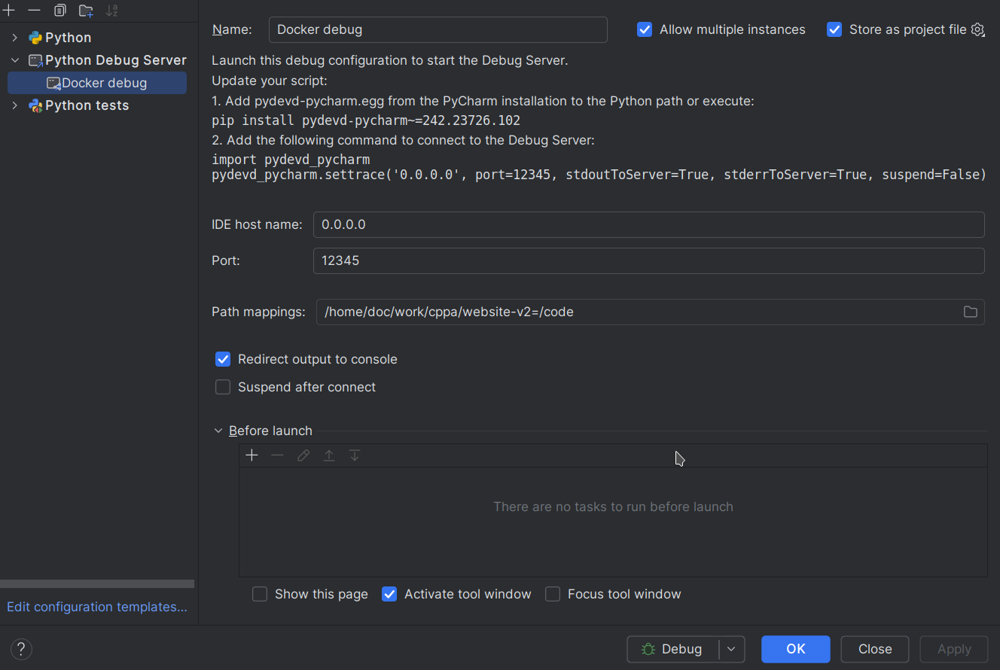

# Boost.org Website

## Overview

A Django based website that will power a new Boost website. See the [documentation](./docs/README.md) for more information about maintaining this project.

Links:

- https://www.stage.boost.cppalliance.org/ - staging
- https://www.boost.org/ - production

---

## Local Development Setup

This project uses Python 3.11, Docker, and Docker Compose.

This document describes how to set up a development environment using Nix, which is a package manager that allows for reproducible builds and development environments, like a better encapsulated declarative cross-platform Homebrew.

For a basic rundown on Nix, this video could be useful https://www.youtube.com/watch?v=yQwW8dkuHqw

1. Install the following according to the instructions for your platform if not already installed:
   1. Direnv - https://direnv.net/docs/installation.html (don't install OS packaged version, must be >= 2.35.0) and then configure your shell to add the hook as per the direnv docs.
   2. Docker Engine
      * Linux - https://docs.docker.com/engine/install/
      * MacOS - https://orbstack.dev/ or https://github.com/abiosoft/colima ?
      * Windows - ?
   3. Just - https://just.systems/man/en/packages.html
   4. Nix - https://nixos.org/download/ (multi-user, y to all options)
2. Clone this https://github.com/boostorg/website-v2.git repository to your machine.
3. cd into the repository directory.
4. In a terminal run `just bootstrap` in the root of the checked out repository to install the necessary development dependencies and generate the .env file.
   * This will ask you to log in to your google account to allow permissions for the production database load later. Ask Sam for permissions on the database backup drive with an email address associated with Google.
5. Update the generated .env file with the necessary environment variables. Where you can't retrieve these yourself, you can ask someone for some in #boost-website on the slack server at https://ccplang.slack.com. The minimum that must be set is:
   * GITHUB_TOKEN - a personal access token for the GitHub API, from your profile
   * STATIC_CONTENT_AWS_ACCESS_KEY_ID - ask for this
   * STATIC_CONTENT_AWS_SECRET_ACCESS_KEY - ask for this
5. Run `just setup` to build services, and build the JS and CSS assets. If docker fails with permissions errors, reboot your machine.
6. Run `just load_production_data` to download live data from the backup server.
7. Run `docker compose up` to start the server.

### Social Login with django-allauth

Follow these instructions to use the social logins through django-allauth on your local machine.

See https://testdriven.io/blog/django-social-auth/ for more information.

#### Github
- Go to https://github.com/settings/applications/new and add a new OAuth application
- Set `http://localhost:8000` as the Homepage URL
- Set `http://localhost:8000/accounts/github/login/callback/` as the Callback URL
- Click whether you want to enable the device flow
   - 
- On completion copy the Client ID and Client Secret to the `.env` file as values of `GITHUB_OAUTH_CLIENT_ID` and `GITHUB_OAUTH_CLIENT_SECRET`.
- Run `direnv allow` and restart your docker containers.

Setup should be complete and you should be able to see an option to "Use Github" on the sign up page.

To test the flow including authorizing Github for the Boost account, log into your GitHub account settings and click **Applications** in the left menu. Find the "Boost" authorization and delete it. The next time you log into Boost with this GitHub account, you will have to re-authorize it.


This setup process is not something that can currently be automated through terraform because of a lack of relevant Github API endpoints to create Oauth credentials.

#### Google

More detailed instructions at:

https://docs.allauth.org/en/latest/socialaccount/providers/google.html

1. Update the `.env` file with values for:
   1. `TF_VAR_google_cloud_email` (the email address of your Google Cloud account)
   2. `TF_VAR_google_organization_domain` (usually the domain of your Google Cloud account, e.g. "boost.org" if you will be using a @boost.org email address)
   3. `TF_VAR_google_cloud_project_name` (optional, default: localboostdev) - needs to change if destroyed and a setup is needed within 30 days
2. Run `just development-tofu-init` to initialize tofu.
3. Run `just development-tofu-plan` to confirm the planned changes.
4. Run `just development-tofu-apply` to apply the changes.
5. Go to https://console.developers.google.com/
   1. Search for the newly created project, named "Boost Development" (ID: localboostdev by default).
   2. Type "credentials" in the search input at the top of the page.
   3. Select "Credentials" under "APIs & Services".
      1. Click "+ CREATE CREDENTIALS"
      2. Select "OAuth Client ID"
      3. Select Application Type: "Web application"
      4. Name: "Boost Development" (arbitrary)
      5. For "Authorized Javascript Origins" use:`http://localhost:8000`
      6. For "Authorized Redirect URIs" use:
         * `http://localhost:8000/accounts/google/login/callback/`
         * `http://localhost:8000/accounts/google/login/callback/?flowName=GeneralOAuthFlow`
      7. Save
6. From the page that's displayed, update the `.env` file with values for the following:
   - `GOOGLE_OAUTH_CLIENT_ID` should be similar to "k235bn2b1l1(...)asdsk.apps.googleusercontent.com"
   - `GOOGLE_OAUTH_CLIENT_SECRET` should be similar to "LAJACO(...)KLAI612ANAD"
7. Run `docker compose down && docker compose up` and restart your docker containers.

Point 5 above can not be automated through terraform because of a lack of relevant Google Cloud API endpoints to create Oauth credentials.

Setup should be complete and you should be able to see an option to "Use Google" on the sign up page.

#### Additional Notes on allauth login flows:
**Working locally**: If you need to run through the login flows multiple times, create a superuser so you can log into the admin. Then, log into the admin and delete your "Social Account" from the admin. This will test a fresh connection to GitHub for your logged-in GitHub user.

## Syncing EmailData Locally (optional)

To work with mailinglist data locally, the django application expects to be
able to query a copy of the hyperkitty database from HYPERKITTY_DATABASE_NAME.
Then, `just manage sync_mailinglist_stats` management command can be run.

## Debugging
For local development there is Django Debug Toolbar, and the option to set a debugger.

In your env:
- Django Debug Toolbar, enabled by default, can be disabled by setting DEBUG_TOOLBAR=False
- IDE Debugging, disabled by default, can be enabled by uncommenting `PYTHONBREAKPOINT` in your .env file.

### Set Up Pycharm
You can set up your IDE with a new "Python Debug Server" configuration as:



### Debugger Usage
To use the debugger add `breakpoint()` on a line in the code before you want to start debugging and then add breakpoints by clicking on the gutter. The debugger will stop at these point, you can then step/inspect the variables.


## Troubleshooting

### Docker
Keep in mind if there are issues with docker that the host docker daemon on your machine and the docker daemon in the nix setup may not match. It's a good idea to keep both up to date.

### Direnv
when you switch to the directory you may see direnv exporting a bunch of environment variables as below.

The installer configures direnv to suppress those but it's a recent configuration option, so may be worth checking for an update if you see them.

## Disk space
Should you find you're running short on disk space, to delete previous versioned store data you can run `nix-collect-garbage -d`. Reentering the directory will then reinstall all the current dependencies again. It's probably a good idea to run that periodically.

```shell
direnv: export +ALLOWED_HOSTS +AR +AS...
```
