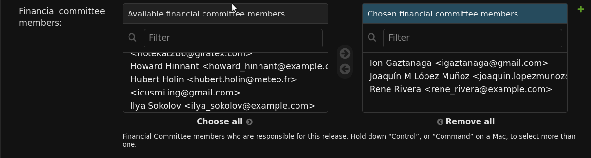
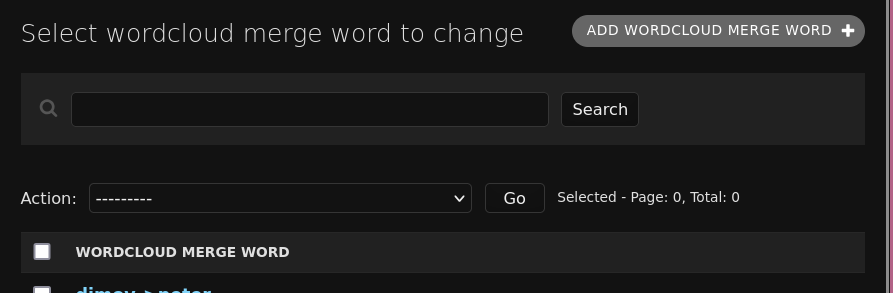

# Release Reports

## Prerequisites

1. You should upload updated subscriber data.
   1. Ask Sam for a copy of the "subscribe" data.
   2. In the Django admin interface go to "Subscription datas" under "MAILING_LIST".
   3. At the top of the page click on the "IMPORT 'SUBSCRIBE' DATA" button.
2. To update the mailing list counts, if you haven't already run the "GET RELEASE REPORT DATA" button:
   1. Go to "Release Reports" under "VERSIONS" in the admin interface
   2. At the top of the page click on the "GET RELEASE REPORT DATA" button.

## Report Creation

1. Go to /admin
2. Go to the "Libraries" section
3. In the top menu click on "GET RELEASE REPORT".
    
4. On the next page check "No cache"
5. Choose a version from the "version" dropdown and click submit

## Configuration options

### Fiscal Sponsorship Committee
To set the content, in the "Versions" section, set the value for "Sponsor message" to the text you want to see.

You should also add committe members under "Financial Committee Members", adding users from "Available financial committee members" to "Chosen financial committee members". These will be sorted alphabetically, and images are taken from the members' avatars.

To update the user's avatar, if the user has given permission, go to the user's profile in the "Users" section, abd set the avatar under "Image".

### Mailing List Word Cloud

#### Merging Words

To merge words, go to the "Wordlcoud merge words" section, and click on "ADD WORDCLOUD MERGE WORD".

Then you can add the word you want to merge, and the word you want to merge it into.

e.g. in this case, all instances of "falco" in the list will be merged into "vinnie".

By default all displayed words are lowercase. Should you want to have one that starts with a capital letter, you can do that using a merge word, which are applied after case is normalized.

#### Excluding Words

To exclude a word go to the "Site Settings" section, open the site setting that exists, and under "Wordcloud ignore", add comma separated words you wish to have excluded from the word cloud.

With the value as you can see it below we remove "\_\_(...)\_\_" because it's just formatting from the mailing list, and Boost because it's redundant.

## Slack Channel Descriptions

These are retrieved from the "Description" field as set on the Slack channel itself.

## Library Rankings
There are three "quality" rankings, semi-comparable to "great", "good", "standard".

1. When a library is ranked as "great" it's prefixed by a filled star in the "Library Index".
2. When a library is ranked as "good" it's prefixed by an outlined star in the "Library Index".
3. When a library is ranked as "standard" it's prefixed by nothing in the "Library Index".

The "Library Index" is ranked by quality while the library listing is ranked alphabetically.

By default, all libraries are ranked "standard".

To set a library as "great", upload an image to the "Library Graphic" field to the library instance in the "Library" section.

To set a library as "good", check "Good Library" in the library instance in the "Library" section.

